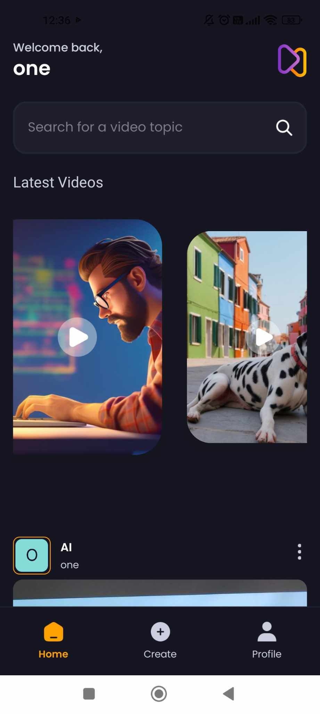
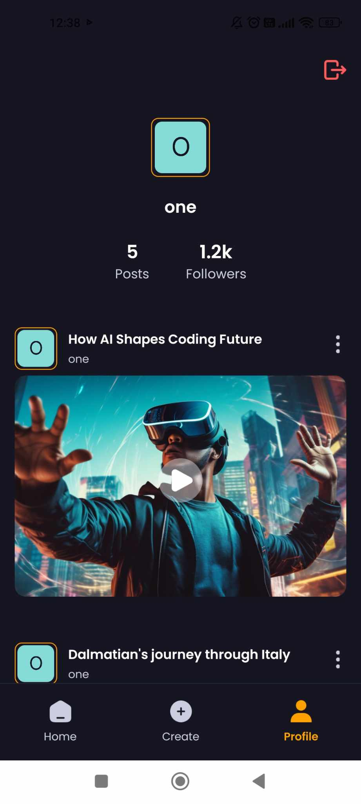

# Aora : Mobile Application for AI Video Prompt Sharing

This mobile application enables users to share AI-generated videos along with the prompts used for their creation. Built with React Native, the app includes a video upload feature and an authentication system. All user data is securely stored using the Appwrite backend database.

## Home Page

## Create Page

## User Page

